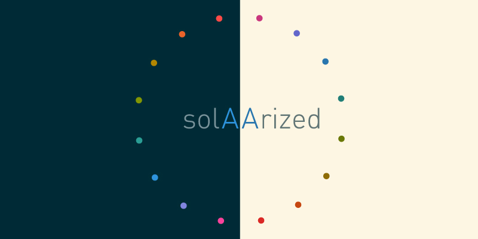

Solarized is an excellent color theme, but most of the color combinations are not accessible. According to the [WCAG 2.0 level AA requirements for contrast](https://www.w3.org/TR/UNDERSTANDING-WCAG20/visual-audio-contrast-contrast.html):

>The visual presentation of text and images of text has a contrast ratio of at least 4.5:1

SolAArized (get it? AA compliant?) sets out to rectify this situation by slightly modifying the colors so that they all have a contrast against the background of at least 4.5:1.

To accomplish this, *two sets* of spot colors were created, rather than one. In this way, the spot colors could be lightened against the dark background, and darkened against the light background. The result is two different yet thematically similar palettes that are much more legible than the original.

## Contributing

Feel free to open pull requests with more implementations of SolAArized. I've only created the implementations I need, but welcome more (X Code, Visual Studio, etc).

## License

[ISC](https://opensource.org/licenses/ISC)